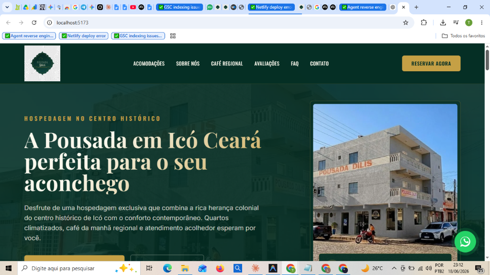

# Pousada Dilis - Landing Page de Alta Performance e Conversão

Esta é a Landing Page oficial da **Pousada Dilis**, localizada em **Icó - Ceará**, otimizada para SEO Local, velocidade de carregamento mobile e alta taxa de conversão.



## 🚀 Diferenciais do Projeto

*   **Mobile-First & Ultra Fast:** Desenvolvido pensando na usabilidade em smartphones, atingindo notas excelentes no Google PageSpeed Insights.
*   **Otimização Automática de Imagens:** Script automatizado (`scripts/convert-webp.mjs`) integrado ao comando de build que varre as imagens da pasta `public/` nos formatos JPG, JPEG, PNG e JFIF, convertendo-as para o formato otimizado `.webp` através da biblioteca `sharp`.
*   **SEO Local Avançado:** Código HTML estruturado semanticamente, meta tags sociais (Open Graph/Twitter Cards) e marcação de dados estruturados JSON-LD do tipo `LodgingBusiness` integrada para melhor rankeamento no Google Meu Negócio / Maps.
*   **Design Premium:** Paleta de cores corporativa baseada no Verde Escuro colonial (`#042E24`), Dourado (`#C5A045`) e Creme (`#FAF8ED`), com tipografia moderna (Playfair Display, Oswald e Inter).
*   **Interatividade Nativa:** Efeitos suaves de revelação na rolagem (Scroll Reveal via `IntersectionObserver`), Menu Mobile e FAQ interativos rodando sem frameworks pesados.

---

## 📈 Otimizações de SEO & Campanha do Forricó

Focando no grande evento regional **Forricó**, o site passou por um processo de otimização estrutural de SEO:
*   **Meta Description Otimizada:** Encurtada para 158 caracteres com palavras-chave vitais: *"Pousada em Icó a 2 minutos do Forricó. Hospedagem aconchegante, café da manhã regional, WiFi e ar-condicionado. Centro histórico."*
*   **Dados Estruturados de FAQ (FAQPage Schema):** Integração de JSON-LD com as principais dúvidas mapeadas, aumentando a probabilidade de exibição de Rich Snippets nas pesquisas do Google.
*   **Enriquecimento LodgingBusiness:** Adição de dados como número de quartos (`numberOfRooms`), horários de check-in (`checkinTime`) e check-out (`checkoutTime`).
*   **Rastreamento e Indexação:** Criação de arquivos de SEO padrão em `/public`:
    *   `robots.txt` (diretrizes claras para robôs do Google).
    *   `sitemap.xml` (mapa de rastreabilidade rápida).
*   **Localização Contextualizada:** Atualização textual de proximidade destacando os *"2 minutos a pé do Largo do Forricó"* para atrair buscas locais sazonais.

---

## 🛠️ Stack Utilizada

*   **Vite** (Bundler e servidor de desenvolvimento ultra-rápido)
*   **Tailwind CSS** (Framework utilitário para estilização responsiva)
*   **PostCSS & Autoprefixer** (Processamento e compatibilidade de CSS)
*   **Sharp** (Processamento e compressão inteligente de imagens em Node.js)
*   **HTML5 Semântico & Vanilla JavaScript**

---

## 📂 Como Rodar o Projeto Localmente

### 1. Instalar as dependências do projeto
```bash
npm install
```

### 2. Iniciar o servidor de desenvolvimento
Inicia o projeto localmente com Hot Module Replacement (HMR) na porta padrão (geralmente http://localhost:5173/):
```bash
npm run dev
```

### 3. Gerar a compilação de produção
Varre e converte as imagens para `.webp` automaticamente e compila o código final minificado na pasta `/dist`:
```bash
npm run build
```

### 4. Visualizar o build de produção localmente
Inicia um servidor local para visualizar exatamente como ficou o site compilado na pasta `/dist` (porta padrão http://localhost:4173/):
```bash
npm run preview
```

---

## 📸 Como Atualizar as Fotos e Logotipo

Basta substituir os arquivos dentro de `public/images/` mantendo as extensões e os mesmos nomes de arquivos. O script de build se encarrega de convertê-los automaticamente para `.webp`:

1.  **Imagem Principal do Hero:** Substitua `hero_pousada.jpg` (ou `.png`)
2.  **Imagem da Seção Sobre:** Substitua `room.jfif` (ou `.png`/`.jpg`)
3.  **Imagem do Café da Manhã:** Substitua `breakfast.png` (ou `.jpg`)
4.  **Favicon do Site:** Salve o ícone como `favicon.png` na raiz da pasta `/public/`
5.  **Logotipo com Transparência:** Salve como `logo.png` em `public/images/logo.png`

Após a substituição, rode `npm run build` no terminal para compilar a versão final com as novas imagens!
